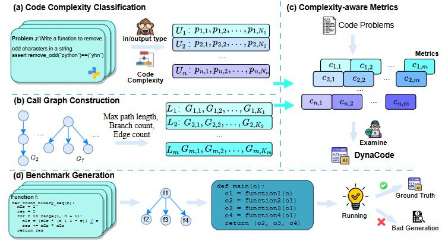
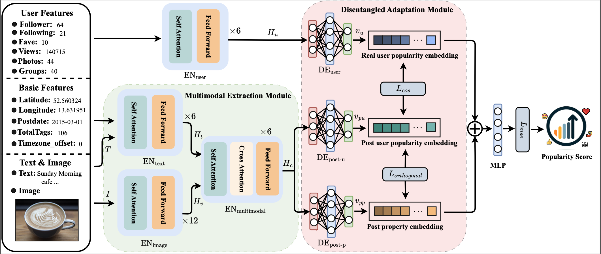
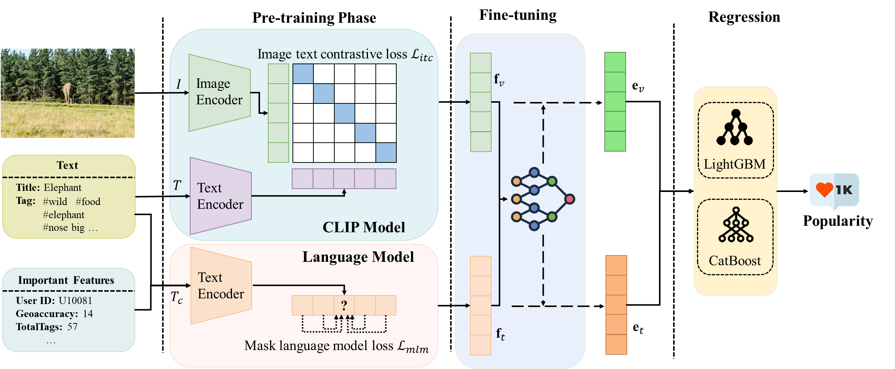
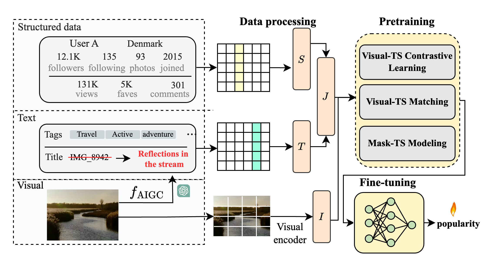








# 👋 About Me
I recently received my M.Sc. degree in Computer Science and Technology from the **University of Electronic Science and Technology of China (UESTC)** in 2025, advised by Prof. [Yanru Zhang](https://faculty.uestc.edu.cn/yanruzhang/en/index.htm). Prior to that, I obtained my B.Eng. degree in Computer Science and Technology from **Hainan University** in 2022.

---

# 🔍 Research
My research interest currently focuses on:
- **Large Language Models (LLMs)**
- **AI4Code**

---

# 🔥 News
- *2025.06*: 🎓 I graduated from the **University of Electronic Science and Technology of China (UESTC)** with an M.Sc. in Computer Science and Technology.  
- *2025.06*: I won the honor of **Outstanding Graduate of Sichuan Province**.  
- *2025.05*: 🎉 Our paper **"DynaCode: A Dynamic Complexity-Aware Code Benchmark for Evaluating Large Language Models in Code Generation"** is accepted by *ACL Findings 2025*.   
- *2025.05*: 🎉 Our paper **"LLM-UIE: Efficient Unified Information Extraction Framework based on Large Language Models"** is accepted by *ASOC (CCF-B, JCR-Q1)*.  
- *2025.04*: I won the honor of **Outstanding Graduate of UESTC**.  
- *2024.11*: Our paper **"Feature Disentangling Dual-stream Network for User Bias Alleviation in Social Media Prediction"** is accepted by *ICASSP 2025 (CCF-B)*.  
- *2024.09*: Our paper **"Tri-Modal Transformers with Mixture-of-Modality-Experts for Social Media Prediction"** is accepted by *TCSVT (CCF-B, JCR-Q1)*.  
- *2024.08*: Our paper **"Dual-Stream Pre-Training Transformer to Enhance Multimodal Learning for Social Media Prediction"** is accepted by *ACM MM 2024 (CCF-A)*.  
- *2024.06*: 🏆 I won the **Top Performance Award** of *ACM Multimedia Social Media Prediction Challenge 2024*.  
- *2023.06*: 🏆 I won the **Top Performance Award** of *ACM Multimedia Social Media Prediction Challenge 2023*.  
- *2022.08*: I joined the Intelligame Lab at UESTC as a Master student.  
- *2022.06*: 🏆 I won the **Top Performance Award** of *ACM Multimedia Social Media Prediction Challenge 2022*.  
- *2022.06*: 🎓 I received my **B.Eng. in Computer Science and Technology** from *Hainan University* (GPA: 3.8/4.0, top 2.6%).  

---

# 📝 Selected Publications

Findings of ACL 2025

[DynaCode: A Dynamic Complexity-Aware Code Benchmark for Evaluating Large Language Models in Code Generation](https://arxiv.org/pdf/2503.10452)  
**Wenhao Hu**, Jinhao Duan, Chunchen Wei, Li Zhang, Yue Zhang, Kaidi Xu  
*Findings of ACL*, 2025  

---

ICASSP 2025

[Feature Disentangling Dual-stream Network for User Bias Alleviation in Social Media Prediction](https://ieeexplore.ieee.org/abstract/document/10890121)  
**Wenhao Hu**, Weilong Chen, Weimin Yuan, Xiaolu Chen, Yan Wang, Yanru Zhang, Zhu Han   
*ICASSP (CCF-B)*, 2025  

---

ACM MM 2024

[Dual-Stream Pre-Training Transformer to Enhance Multimodal Learning for Social Media Prediction](https://dl.acm.org/doi/10.1145/3664647.3688998)  
**Wenhao Hu**, Weilong Chen, Weimin Yuan, Yan Wang, Shimin Cai, Yanru Zhang  
*ACM Multimedia (CCF-A)*, 2024  

---

TCSVT 2024

[Tri-Modal Transformers with Mixture-of-Modality-Experts for Social Media Prediction](https://ieeexplore.ieee.org/abstract/document/10705363)  
Weilong Chen, **Wenhao Hu**, Xiaolu Chen, Weimin Yuan, Yan Wang, Yanru Zhang, Zhu Han  
*IEEE Transactions on Circuits and Systems for Video Technology (TCSVT, CCF-B)*, 2024  

---

# 🎖 Honors and Awards
2025.06: 🎓 Outstanding Graduate of Sichuan Province  
2025.04: 🎓 Outstanding Graduate of UESTC  
2024.11: 🎓 China National Scholarship (China)  
2024.09: 🏅 First-class Scholarship of UESTC  
2023.09: 🏅 First-class Scholarship of UESTC  
2022.09: 🏅 First-class Scholarship of UESTC  
2023.06: 🎓 Outstanding Graduate Student of UESTC  
2024.09: 🏆 Best Performance Prize, ACM MM SMP 2024 International Challenge  
2023.09: 🏆 Best Performance Prize, ACM MM SMP 2023 International Challenge  
2022.09: 🏆 Best Performance Prize, ACM MM SMP 2022 International Challenge  
2022.06: 🎓 Outstanding Graduate of Hainan University

---

# 📚 Education

  
  

    <b>M.Sc. in Computer Science and Technology</b> (2022.09 – 2025.06)  
    University of Electronic Science and Technology of China (UESTC), Chengdu, China  
    GPA: 3.7/4.0  
    Advisor: Prof. <a href="https://faculty.uestc.edu.cn/yanruzhang/en/index.htm">Yanru Zhang</a>
  

  
  

    <b>B.Eng. in Computer Science and Technology</b> (2018.09 – 2022.06)  
    Hainan University, Haikou, China  
    GPA: 3.8/4.0 (top 2.6%)
  

---

# 💼 Service
- *2025*: Reviewer for ICASSP, ICME, IJCNN, AAAI@GenAI4Health  
- *2024*: Reviewer for ACM MM, ICME  

