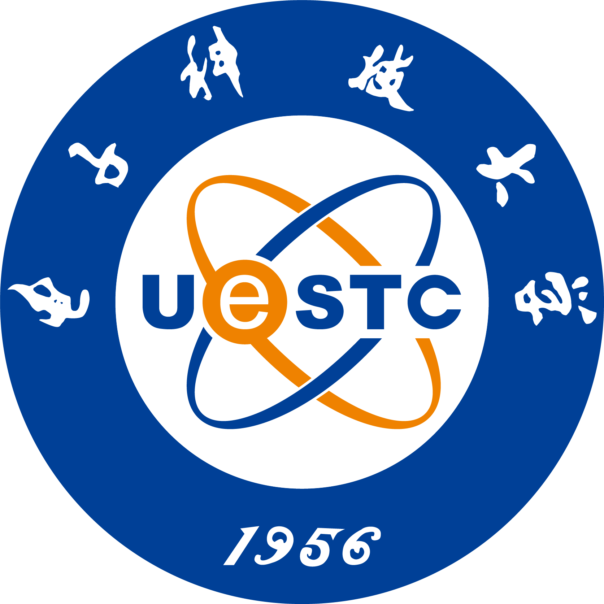








# 👋 About Me
I am a 3rd-year Master student at the [Intelligame Lab](https://faculty.uestc.edu.cn/yanruzhang/en/index.htm), [University of Electronic Science and Technology of China (UESTC)](https://en.uestc.edu.cn/), advised by Prof. [Yanru Zhang](https://faculty.uestc.edu.cn/yanruzhang/en/index.htm).  

My research interests lie in **Large Language Models**, **AI4Code**, and **Social Media Analysis**.  

📧 [Email](mailto:wenhaohu2000@gmail.com) &nbsp;/&nbsp; [Google Scholar](https://scholar.google.com/citations?user=TIGGcswAAAAJ&hl=zh-CN) &nbsp;/&nbsp; [GitHub](https://github.com/HWH-2000)  

---

# 🔥 News
- *2025.05*: 🎉 Our paper **"DynaCode: A Dynamic Complexity-Aware Code Benchmark for Evaluating Large Language Models in Code Generation"** is accepted by *ACL Findings 2025*.  
- *2025.05*: 🎉 Our paper **"LLM-UIE: Efficient Unified Information Extraction Framework based on Large Language Models"** is accepted by *ASOC (CCF-B, JCR-Q1)*.  
- *2025.04*: I won the honor of **Outstanding Graduate of UESTC**.  
- *2024.11*: Our paper **"Feature Disentangling Dual-stream Network for User Bias Alleviation in Social Media Prediction"** is accepted by *ICASSP 2025 (CCF-B)*.  
- *2024.09*: Our paper **"Tri-Modal Transformers with Mixture-of-Modality-Experts for Social Media Prediction"** is accepted by *TCSVT (CCF-B, JCR-Q1)*.  
- *2024.08*: Our paper **"Dual-Stream Pre-Training Transformer to Enhance Multimodal Learning for Social Media Prediction"** is accepted by *ACM MM 2024 (CCF-A)*.  
- *2024.06*: 🏆 I won the **Top Performance Award** of *ACM Multimedia Social Media Prediction Challenge 2024*.  
- *2023.06*: 🏆 I won the **Top Performance Award** of *ACM Multimedia Social Media Prediction Challenge 2023*.  
- *2022.08*: I joined the Intelligame Lab at UESTC as a Master student.  
- *2022.06*: 🏆 I won the **Top Performance Award** of *ACM Multimedia Social Media Prediction Challenge 2022*.  
- *2022.06*: 🎓 I received my **B.Eng. in Computer Science and Technology** from *Hainan University* (GPA: 3.8/4.0, top 2.6%).  

---

# 📝 Selected Publications

Findings of ACL 2025

[DynaCode: A Dynamic Complexity-Aware Code Benchmark for Evaluating Large Language Models in Code Generation](https://arxiv.org/pdf/2503.10452)  
**Wenhao Hu**, Jinhao Duan, Chunchen Wei, Li Zhang, Yue Zhang, Kaidi Xu  
*Findings of ACL*, 2025  

-  [Dual-Stream Pre-Training Transformer to Enhance Multimodal Learning for Social Media Prediction](https://dl.acm.org/doi/10.1145/3664647.3688998), **Wenhao Hu**, Weilong Chen, Weimin Yuan, Yan Wang, Shimin Cai, Yanru Zhang. *ACM MM 2024*.  

-  [Tri-Modal Transformers with Mixture-of-Modality-Experts for Social Media Prediction](https://ieeexplore.ieee.org/abstract/document/10705363), Weilong Chen, **Wenhao Hu**, Xiaolu Chen, Weimin Yuan, Yan Wang, Yanru Zhang, Zhu Han. *TCSVT 2024*.  

-  [Title-and-Tag Contrastive Vision-and-Language Transformer for Social Media Popularity Prediction](https://dl.acm.org/doi/10.1145/3503161.3551568), Weilong Chen, Chenghao Huang, Weimin Yuan, Xiaolu Chen, **Wenhao Hu**, Xinran Zhang, Yanru Zhang. *ACM MM 2022*.  

---

# 🎖 Honors and Awards
- *2025*: Outstanding Graduate of UESTC  
- *2022, 2023, 2024*: Top Performance Award, ACM Multimedia Social Media Prediction Challenge  

---

# 📖 Education
-  *2022.09 – present*, **M.Sc. in Computer Science and Technology**, University of Electronic Science and Technology of China (UESTC).  
  GPA: 3.7/4.0. Advisor: Prof. [Yanru Zhang](https://faculty.uestc.edu.cn/yanruzhang/en/index.htm).  

-  *2018.09 – 2022.07*, **B.Eng. in Computer Science and Technology**, Hainan University.  
  GPA: 3.8/4.0 (top 2.6%).  

---

# 💼 Service
- *2025*: Reviewer for ICASSP, ICME, IJCNN, AAAI@GenAI4Health  
- *2024*: Reviewer for ACM MM, ICME  

---

# 🙌 Acknowledgement
This homepage is built using the [AcadHomepage](https://github.com/RayeRen/acad-homepage.github.io) Jekyll template. Original design inspirations from [Jon Barron](https://jonbarron.info) and [Tianxiang Sun](https://txsun1997.github.io/).
